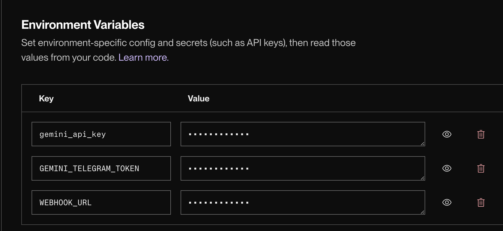
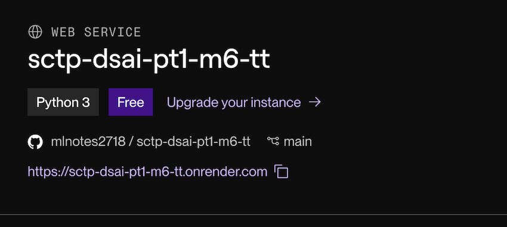

# Instruction to add Telegram Functionality

1. create a new html page as follow:

```html
<head>
    <meta name ="viewport" content ="width=device-width,initial-scale=1.0">
    <link rel="stylesheet" href="{{url_for('static',filename='styles.css')}}">
</head>
<body>
    <div class="container">
        <h2>Financial Advisor Chatbot in Telegram</h2>
        <h4>{{status}}</h4>
        <form action="/main" method="post">         
            <input type="submit" value="Main">
        </form>
    </div>
</body>
```

2. Add the following code to `app.py`

```python
@app.route("/start_telegram",methods=["GET","POST"])
def start_telegram():

    domain_url = os.getenv('WEBHOOK_URL')

    # The following line is used to delete the existing webhook URL for the Telegram bot
    delete_webhook_url = f"https://api.telegram.org/bot{gemini_telegram_token}/deleteWebhook"
    requests.post(delete_webhook_url, json={"url": domain_url, "drop_pending_updates": True})
    
    # Set the webhook URL for the Telegram bot
    set_webhook_url = f"https://api.telegram.org/bot{gemini_telegram_token}/setWebhook?url={domain_url}/telegram"
    webhook_response = requests.post(set_webhook_url, json={"url": domain_url, "drop_pending_updates": True})
    print('webhook:', webhook_response)
    if webhook_response.status_code == 200:
        # set status message
        status = "The telegram bot is running. Please check with the telegram bot. @gemini_tt_bot"
    else:
        status = "Failed to start the telegram bot. Please check the logs."
    
    return(render_template("telegram.html", status=status))

@app.route("/telegram",methods=["GET","POST"])
def telegram():
    update = request.get_json()
    if "message" in update and "text" in update["message"]:
        # Extract the chat ID and message text from the update
        chat_id = update["message"]["chat"]["id"]
        text = update["message"]["text"]

        if text == "/start":
            r_text = "Welcome to the Gemini Telegram Bot! You can ask me any finance-related questions."
        else:
            # Process the message and generate a response
            system_prompt = "You are a financial expert.  Answer ONLY questions related to finance, economics, investing, and financial markets. If the question is not related to finance, state that you cannot answer it."
            prompt = f"{system_prompt}\n\nUser Query: {text}"
            r = genmini_client.models.generate_content(
                model=genmini_model,
                contents=prompt
            )
            r_text = r.text
        
        # Send the response back to the user
        send_message_url = f"https://api.telegram.org/bot{gemini_telegram_token}/sendMessage"
        requests.post(send_message_url, data={"chat_id": chat_id, "text": r_text})
    # Return a 200 OK response to Telegram
    # This is important to acknowledge the receipt of the message
    # and prevent Telegram from resending the message
    # if the server doesn't respond in time
    return('ok', 200)
```
**Please note that because I use different API, the way we call gemini is different. You need to modify the follow at the from of the `app.py`.**

```python
import google.generativeai as genai1
from google import genai
```

```python
gemini_api_key = os.getenv("gemini_api_key")

genmini_client = genai.Client(api_key=gemini_api_key)
genmini_model = "gemini-2.0-flash"

genai1.configure(api_key=gemini_api_key)
model = genai1.GenerativeModel("gemini-2.0-flash")

gemini_telegram_token = os.getenv('GEMINI_TELEGRAM_TOKEN')
```

## Environment Settings
Please also check your environment as shown below:


**IMPORTANT: the environment is case sensitive, you must follow the same casing in the `app.py` and in the settings above.**

The `GEMINI_TELEGRAM_TOKEN` is the same token key that we practice on colab.

For `WEBHOOK_URL`, you can get your webhook url at your render.com dashboard similar to the image below :



Please also include make sure you have the following in requirement files.
```text
flask
gunicorn
google-genai
google-generativeai
requests
```

**IMPORTANT: To test telegram, we need to deploy and run on render.com. Testing locally is not possible unless you get a public address from Ngrok and configure some network settings.**